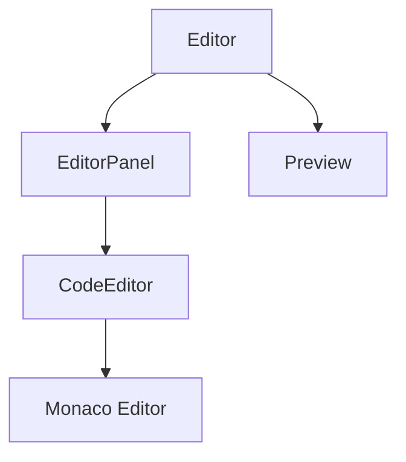

# Architecture Overview 🏗️

This document provides a detailed overview of the Code Editor's architecture and design decisions.

## Core Principles

1. **Simplicity**: Focus on core functionality without unnecessary complexity
2. **Performance**: Optimize for fast rendering and real-time preview
3. **Modularity**: Keep components small and focused
4. **Maintainability**: Clear code organization and documentation

## Component Architecture

### Editor Module

- **Editor**: Orchestrates the overall editor experience
- **EditorPanel**: Manages individual code panels
- **Preview**: Renders the combined code output
- **CodeEditor**: Wraps Monaco Editor functionality

### State Management

- Uses React's built-in state management
- Implements debouncing for preview updates
- Maintains separate state for HTML, CSS, and JavaScript

### Theme System

- Leverages next-themes for system-wide theming
- Supports system preference detection
- Provides seamless dark/light mode transitions

## Performance Optimizations

1. **Code Debouncing**
   - Prevents excessive preview updates
   - Improves typing performance

2. **Monaco Editor**
   - Lazy-loaded for faster initial page load
   - Configured for optimal memory usage

3. **Preview Rendering**
   - Uses sandboxed iframe
   - Implements efficient DOM updates

## Security Considerations

1. **Code Execution**
   - Sandboxed preview environment
   - Content Security Policy implementation
   - Safe HTML rendering practices

2. **File Downloads**
   - Secure blob URL generation
   - Proper URL cleanup after download

## Future Improvements

1. **Potential Features**
   - Code sharing functionality
   - More language support
   - Custom theme creation
   - Keyboard shortcuts

2. **Technical Enhancements**
   - Service Worker integration
   - Offline support
   - Performance monitoring
   - Accessibility improvements